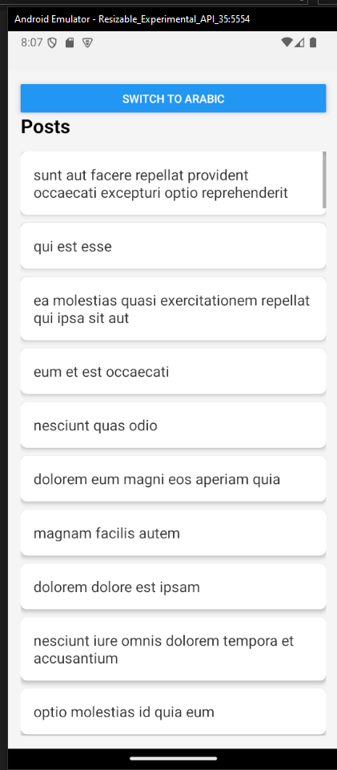
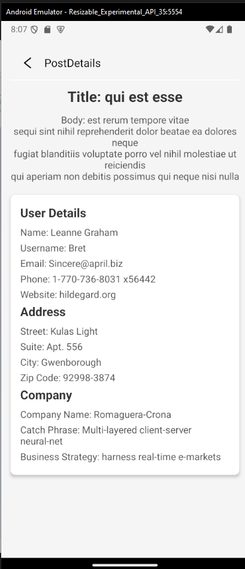

# Posts List & Details App

This React Native project demonstrates fetching and displaying posts from an API, with multi-language support for both Arabic (RTL) and English (LTR). It includes two main screens: a Posts List screen and a Post Details screen.

## Table of Contents

- [Installation](#installation)
- [Running the Application](#running-the-application)
- [Project Structure](#project-structure)
- [Language Support](#language-support)
- [State Management](#state-management)
- [Error Handling](#error-handling)
- [Screenshots](#screenshots)
- [Contributing](#contributing)
- [License](#license)

## Installation

Follow these steps to set up the project locally.

1. **Clone the repository**:

   ```bash
   git clone https://github.com/yourusername/posts-list-app.git
   ```

2. **Navigate to the project directory**:

   ```bash
   cd posts-list-app
   ```

3. **Install dependencies**:

   ```bash
   npm install
   ```

   or, if you are using Yarn:

   ```bash
   yarn install
   ```

4. **Install Expo CLI** (if you don't have it installed):
   ```bash
   npm install -g expo-cli
   ```

## Running the Application

1. **Start the development server**:

   ```bash
   expo start
   ```

2. **Run the application**:
   - Scan the QR code with the Expo Go app on your phone to view the app on a physical device.
   - Alternatively, you can run the app in an emulator.

## Project Structure

Here is an overview of the project structure:

```plaintext
.
├── assets             # Static assets like images and fonts
├── components         # Reusable components
│   └── PostItem.tsx   # Component for displaying a single post item
├── screens            # Application screens
│   ├── PostsListScreen.tsx   # Screen displaying the list of posts
│   └── PostDetailsScreen.tsx # Screen displaying the details of a selected post
├── i18n               # Localization files for multi-language support
│   ├── en.json        # English translations
│   └── ar.json        # Arabic translations
├── App.tsx            # Main entry point of the application
├── app.json           # Expo configuration file
├── package.json       # Project dependencies and scripts
├── tsconfig.json      # TypeScript configuration
└── README.md          # Project documentation
```

## Language Support

This app supports both English (LTR) and Arabic (RTL). Language selection is managed through the `i18n` directory, where translation files (`en.json` and `ar.json`) are stored. You can switch between languages within the app, and the UI will adjust accordingly.

## State Management

The application uses a state management library (such as Redux or Context API) to handle the app's state, including the language settings and fetched data.

## Error Handling

The app includes basic error handling for API requests. If an API call fails, an error message is displayed to the user.

## Screenshots




## Contributing

If you would like to contribute, please fork the repository and use a feature branch. Pull requests are warmly welcome.

1. **Fork the repository**.
2. **Create a feature branch**:
   ```bash
   git checkout -b feature-branch-name
   ```
3. **Commit your changes**:
   ```bash
   git commit -m "Add some feature"
   ```
4. **Push to the branch**:
   ```bash
   git push origin feature-branch-name
   ```
5. **Create a new Pull Request**.

## License

This project is licensed under the MIT License - see the [LICENSE](LICENSE) file for details.
