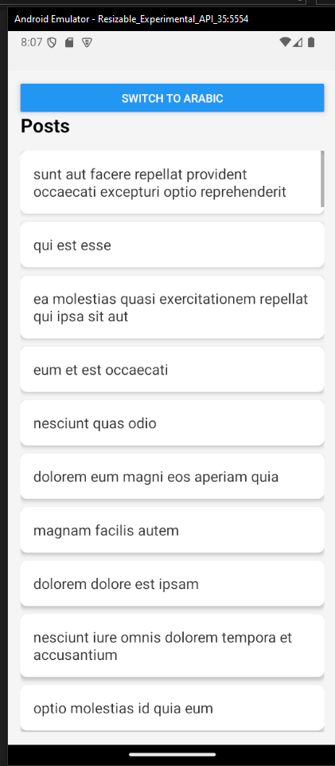
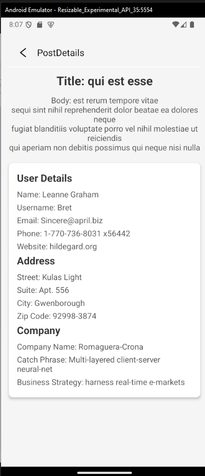

# Posts List & Details App

This React Native project demonstrates fetching and displaying posts from an API, with multi-language support for both Arabic (RTL) and English (LTR). It includes two main screens: a Posts List screen and a Post Details screen.

## Table of Contents

- [Installation](#installation)
- [Running the Application](#running-the-application)
- [Project Structure](#project-structure)
- [Language Support](#language-support)
- [State Management](#state-management)
- [Error Handling](#error-handling)
- [Screenshots](#screenshots)

## Installation

Follow these steps to set up the project locally.

1. **Clone the repository**:

   ```bash
   git clone https://github.com/IslamElswafy/BortoqalaApp.git
   ```

2. **Navigate to the project directory**:

   ```bash
   cd BortoqalaApp
   ```

3. **Install dependencies**:

   ```bash
   npm install
   ```

   or, if you are using Yarn:

   ```bash
   yarn install
   ```

4. **Install Expo CLI** (if you don't have it installed):
   ```bash
   npm install -g expo-cli
   ```

## Running the Application

1. **Start the development server**:

   ```bash
   expo start
   ```

2. **Run the application**:
   - Scan the QR code with the Expo Go app on your phone to view the app on a physical device.
   - Alternatively, you can run the app in an emulator.

## Language Support

This app supports both English (LTR) and Arabic (RTL). Language selection is managed through the `i18n` directory, where translation files (`en.json` and `ar.json`) are stored. You can switch between languages within the app with a bottom, and the UI will adjust accordingly.

## State Management

The application uses a state management library Context API to handle the app's state, including the language settings and fetched data.

## Error Handling

The app includes basic error handling for API requests. If an API call fails, an error message is displayed to the user.

## Screenshots



